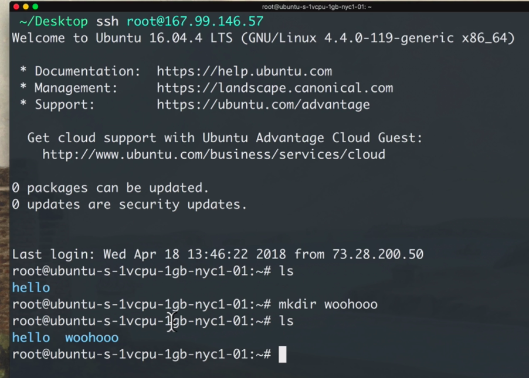
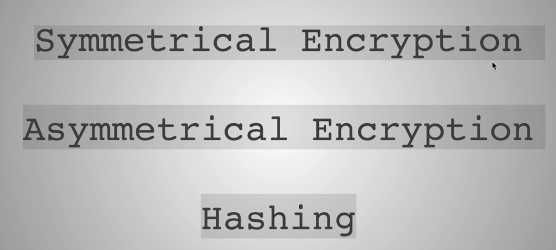
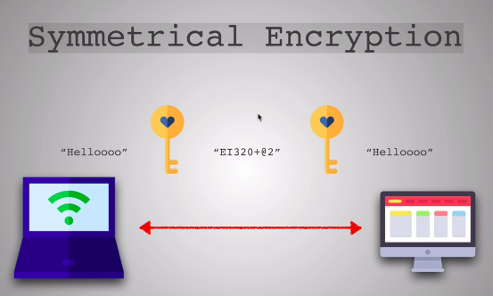

# SSH

Protocol is way to connect two computer and have share agreement of how to connect.
HTTP ===> share the file like html, css, and javascript.
HTTPS ===> same as http but in encrypted form to not breach by third party during transfer of file. if they intercept the message.

SSH or secure shell is also protocol like HTTP, HTTPS, and FTP. SSH allow the user to share the file as well as to controll and modify the remote computer over the internet. It was created as a secure way of communication which again encrypts all data so bad actors can't monitor

https://www.makeuseof.com/tag/beginners-guide-setting-ssh-linux-testing-setup/

https://help.ubuntu.com/community/AptGet/Howto

https://www.tecmint.com/rsync-local-remote-file-synchronization-commands/

# Symmetric Key Encryption

In symmetric key, Their is only one key which encrypt or decrypt the message.

# Asymmetric Key Encryption

In Assymetric key, Their is two key one is public and one is private. Public key used to encrypt a message by another user whereas private key only decrypt the message. You have to share only public key not private key. Private can not be computed by Public key.

# How SSH encryption done
SSH doesn't use Assymetric key type encryption. Assymetric method only used during transfer of Symmetric key.

SSH create a symmetric key encryption method and for exchanging that key. SSH generates temporary Assymetric key which is used only for exchange the key. This method is called Diffie HellMan Key Exchange.

https://www.youtube.com/watch?v=NmM9HA2MQGI
https://www.youtube.com/watch?v=Yjrfm_oRO0w
https://www.youtube.com/watch?v=vsXMMT2CqqE&t=
https://www.youtube.com/watch?v=NF1pwjL9-DE

# Hashing

